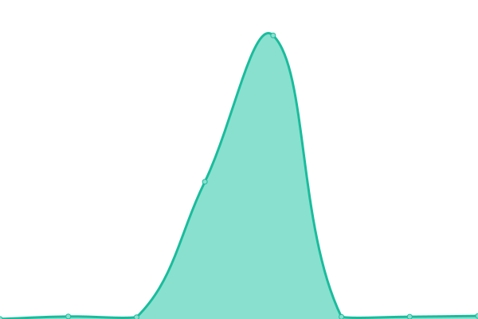

# [📈 Live Status](https://upptime.github.io/upptime): <!--live status--> **🟩 All systems operational**

This repository contains the open-source uptime monitor and status page for [Upptime](https://upptime.js.org), powered by [Upptime](https://github.com/upptime/upptime).

With [Upptime](https://upptime.js.org), you can get your own unlimited and free uptime monitor and status page, powered entirely by a GitHub repository. We use [Issues](https://github.com/upptime/upptime/issues) as incident reports, [Actions](https://github.com/kaylovh/upptime/actions) as uptime monitors, and [Pages](https://upptime.github.io/upptime) for the status page.

<!--start: status pages-->
<!-- This summary is generated by Upptime (https://github.com/upptime/upptime) -->
<!-- Do not edit this manually, your changes will be overwritten -->
<!-- prettier-ignore -->
| URL | Status | History | Response Time | Uptime |
| --- | ------ | ------- | ------------- | ------ |
|  [Google](https://www.google.com) | 🟩 Up | [google.yml](https://github.com/kaylovh/upptime/commits/HEAD/history/google.yml) | 

 92ms
     
 | 

<a href="https://upptime.micropivot.org/history/google">100.00%</a>
    

|  [Baidu](https://www.baidu.com) | 🟩 Up | [baidu.yml](https://github.com/kaylovh/upptime/commits/HEAD/history/baidu.yml) | 

 2282ms
     
 | 

<a href="https://upptime.micropivot.org/history/baidu">100.00%</a>
    

|  [NAS](https://nas.micropivot.org) | 🟩 Up | [nas.yml](https://github.com/kaylovh/upptime/commits/HEAD/history/nas.yml) | 

 388ms
     
 | 

<a href="https://upptime.micropivot.org/history/nas">100.00%</a>
    

|  [LENOVO CBSO UAT](https://cbso-uat.lenovo.com) | 🟩 Up | [lenovo-cbso-uat.yml](https://github.com/kaylovh/upptime/commits/HEAD/history/lenovo-cbso-uat.yml) | 

 379ms
     
 | 

<a href="https://upptime.micropivot.org/history/lenovo-cbso-uat">100.00%</a>
    

|  [LENOVO LBP](https://lbp.lenovo.com) | 🟩 Up | [lenovo-lbp.yml](https://github.com/kaylovh/upptime/commits/HEAD/history/lenovo-lbp.yml) | 

 337ms
     
 | 

<a href="https://upptime.micropivot.org/history/lenovo-lbp">100.00%</a>
    

<!--end: status pages-->

[**Visit our status website →**](https://upptime.github.io/upptime)

## 📄 License

- Powered by: [Upptime](https://github.com/upptime/upptime)
- Code: [MIT](./LICENSE) © [Anand Chowdhary](https://anandchowdhary.com), supported by [Pabio](https://pabio.com)
- Data in the `./history` directory: [Open Database License](https://opendatacommons.org/licenses/odbl/1-0/)
